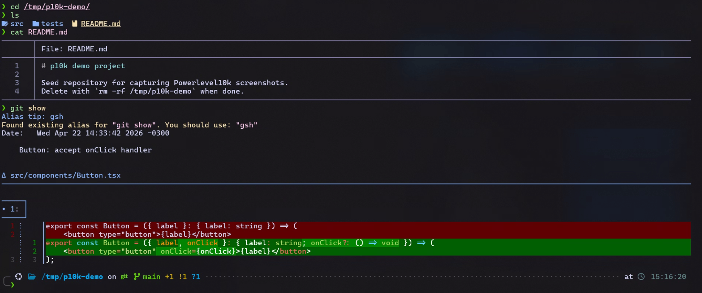
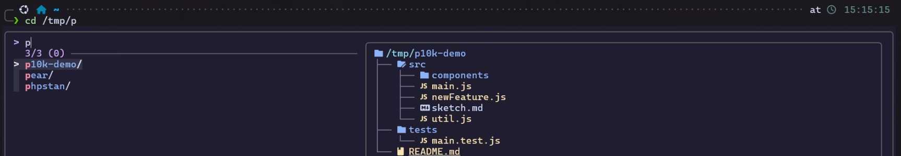
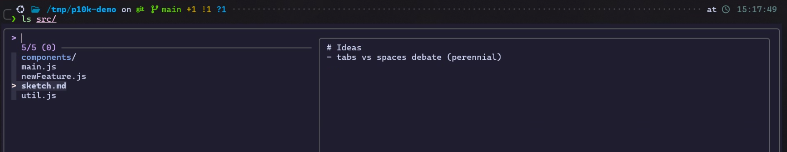

# dotfiles-template

Skeleton for personal dotfiles of any dev. Click **"Use this template"** on GitHub to create your own repo (recommended: private).

> **Languages:** English (this file) · [Português](README.pt-BR.md)

## Preview



Covered: p10k prompt · bat syntax highlight · delta git diff · fzf-tab file/dir preview · Catppuccin Mocha across the stack.

<details>
<summary>Zoom — fzf-tab directory content preview</summary>



</details>

<details>
<summary>Zoom — fzf-tab file content preview + git status integration</summary>



</details>

## Role of this layer

One of three repos in a layered stack:

```
┌──────────────────────────────────────────────────────────────┐
│  dev-bootstrap      →  tools + universal configs             │
│                         (bashrc, inputrc, global gitconfig,  │
│                         ~/.bashrc.d/ fragments, Syncthing…)  │
├──────────────────────────────────────────────────────────────┤
│  dotfiles-template  →  THIS REPO — scaffold + install.sh     │
│                         (.example files + deploy logic)      │
├──────────────────────────────────────────────────────────────┤
│  <you>/dotfiles     →  your private fork: identity + overrides │
│                         (SSH, gitconfig.local, aliases, tokens) │
└──────────────────────────────────────────────────────────────┘
```

**Mental rule:** baseline that every dev receives goes in `dev-bootstrap`. Whatever varies per person or is your own preference goes in a fork of this template.

## Initial setup (fresh fork)

1. Click **"Use this template"** on GitHub → pick "Private" → name it `dotfiles`.
2. Clone and customize:

   ```bash
   git clone git@github.com:YOUR_USER/dotfiles.git ~/dotfiles
   cd ~/dotfiles

   # Rename .example → plain and edit whatever you want to adopt:
   cp ssh/config.example ssh/config                       # hostnames, IdentityFile
   cp git/gitconfig.local.example git/gitconfig.local     # name + email
   cp shell/bashrc.local.example shell/bashrc.local       # (optional)
   cp shell/aliases.sh.example shell/aliases.sh           # (optional)
   cp claude/manifest/mcps-user.sh.example claude/manifest/mcps-user.sh  # user-scope MCPs

   bash install.sh
   ```

3. Normal commits: `git add`, `git commit`, `git push`. **Private is mandatory** if the repo contains internal hostnames, emails, or tokens.

## How it works

`install.sh` is self-contained (zero dependency on dev-bootstrap). For each entry in `MAPPINGS`, it processes files **without** the `.example` suffix:

- **`overwrite` mode** (default): diffs against the destination, keeps a timestamped backup when content changed, then copies.
- **`once` mode** (marked in `MAPPINGS`): deploys only if the destination doesn't exist yet. Meant for files with secret placeholders — after the first install you edit `~/.s3cfg` / `~/.npmrc` directly with real values, and the script preserves them.

```bash
DRY_RUN=1 bash install.sh   # preview without executing
bash install.sh             # apply
```

## What this template deploys

| repo src | destination | mode |
|----------|-------------|------|
| `ssh/config` | `~/.ssh/config` (chmod 600) | overwrite |
| `git/gitconfig.local` | `~/.gitconfig.local` (pulled in via `include.path` set by `dev-bootstrap/50-git` in `~/.gitconfig`) | overwrite |
| `git/gitignore_global` | `~/.config/git/ignore` | overwrite |
| `shell/bashrc.local` | `~/.bashrc.local` (loaded **last** by the bootstrap's `~/.bashrc`) | overwrite |
| `shell/zshrc.local` | `~/.zshrc.local` | overwrite |
| `shell/aliases.sh` | `~/.bashrc.d/99-personal-aliases.sh` **and** `~/.zshrc.d/99-personal-aliases.sh` (the `99-` prefix forces loading after the bootstrap fragments) | overwrite |
| `config/htoprc` | `~/.config/htop/htoprc` (heads-up: htop rewrites this file when you change settings in its UI) | overwrite |
| `config/s3cfg` | `~/.s3cfg` (chmod 600) | **once** |
| `npm/npmrc` | `~/.npmrc` (chmod 600) | **once** |
| `claude/manifest/mcps-user.sh` | `~/.claude/manifest/mcps-user.sh` | overwrite |
| `claude/stignore/claude-config.stignore` | `~/.claude/.stignore` (controls Syncthing under `~/.claude/`) | overwrite |
| `claude/stignore/claude-mem.stignore` | `~/.claude-mem/.stignore` | overwrite |
| `shell/zinit-uninstall.list` | _(read in-place; not deployed)_ | drift cleanup |
| `scripts/doctor.sh` | _(invoked from repo: `bash ~/dotfiles/scripts/doctor.sh`)_ | drift detector |

> `shell/zinit-uninstall.list` is consumed during `bash install.sh` to purge the zinit plugin cache for any plugin you stopped loading from `shell/zshrc.local`. See [Removing zinit plugins](#removing-zinit-plugins-drift-cleanup) below.
> `scripts/doctor.sh` reports drift between repo sources and deployed files. See [Drift detection — `doctor.sh`](#drift-detection--doctorsh) below.

### What this template does NOT manage (comes from `dev-bootstrap`)

- `~/.inputrc` — bootstrap/30-shell (word-kill, completion niceties)
- `~/.bashrc`, `~/.zshrc` — bootstrap/30-shell loaders
- Global `~/.gitconfig` — bootstrap/50-git via `git config --global`
- `~/.config/starship.toml`, `~/.tmux.conf` — bootstrap/20-terminal-ux, 40-tmux
- **Universal shell aliases** (navigation, shortcuts, utility funcs, git, tmux, Laravel, Tailscale, Phase E modern CLI replacements) — each lives in its topic's `~/.bashrc.d/NN-<topic>.sh` + zsh equivalent. Full inventory in [`dev-bootstrap/docs/ALIASES.md`](https://github.com/henryavila/dev-bootstrap/blob/main/docs/ALIASES.md).

If you catch yourself re-declaring any of these, stop. The bootstrap already covers them; your fork should only hold **identity + overrides + personal-only** (project names, paths, tool flags you prefer).

## Claude Sync (since v2026-04-20)

The `claude/` folder introduces cross-machine sync of Claude Code config using **Syncthing P2P** (the daemon is installed by `dev-bootstrap/80-claude-code`).

2-problem-2-tool model:

| Problem | Solution |
|---------|----------|
| **Continuous sync** across N already-configured personal machines | Syncthing with a curated `.stignore` inside `~/.claude/` and `~/.claude-mem/`. Skill discovery on any machine propagates automatically. |
| **Cold-start reproducibility** (fresh machine) | `manifest/mcps-user.sh` — idempotent script that reapplies user-scope MCPs (plugins come via Syncthing once paired). |
| **Initial convergence** (4 already-diverged machines) | Scripts in `claude/scripts/` — `inventory.sh`, `backup.sh`, `merge-claude-mem.py` (preserves memory via `content_hash` dedup). Six-phase playbook in `claude/README.md`. |

Read `claude/README.md` for full details and `claude/scripts/syncthing-setup.md` for the pairing flow.

## Adding a new file to your fork

1. Create `<area>/<name>.example` with commented content explaining each field.
2. Copy `.example` → plain and customize.
3. Add a line to the `MAPPINGS` array in `install.sh`.
4. Add a row to the table in your fork's README.
5. `DRY_RUN=1 bash install.sh` → `bash install.sh`.
6. Commit with a message that explains **why**.

## Shell load order

When opening an interactive shell:

1. `~/.bashrc` (bootstrap/30-shell) — minimal loader.
2. `~/.bashrc.d/NN-<topic>.sh` in alphabetical order — bootstrap fragments:
   - `10-languages.sh` (fnm, composer PATH)
   - `20-terminal-ux.sh` (starship, fzf, zoxide, basic ls/cat aliases)
   - `30-shell.sh` (dircolors, bash-completion)
   - `50-git.sh` (git aliases)
3. `~/.bashrc.d/99-personal-aliases.sh` — **your fork** (the `99-` prefix guarantees it's the last file in `.bashrc.d/`).
4. `~/.bashrc.local` — **your fork**, loaded last of all by the loader.

**Consequence:** your fork always wins if you want to override something from the bootstrap. No forking the bootstrap, no manual edits in `~/.bashrc`.

## Drift detection — `doctor.sh`

After `bash install.sh` deploys files, edits drift over time — `htop` rewrites its config when you change settings in its UI, you tweak `~/.zshrc.local` directly instead of in the repo, an installer overwrites `~/.bashrc`, etc. `doctor.sh` is a zero-dependency drift detector that walks your `MAPPINGS` and reports per file:

- ✓ **up to date** — repo src and deployed dst match byte-for-byte
- ! **missing** — `install.sh` never ran, or you deleted the file
- ✗ **drifted** — dst exists but differs from src (next `install.sh` run will overwrite)
- ! **marker miss** — `~/.bashrc`/`~/.zshrc`/`~/.tmux.conf` don't carry the `managed by dev-bootstrap` header (hand-edited or deployed by another tool)

```bash
bash ~/dotfiles/scripts/doctor.sh             # human-readable report
bash ~/dotfiles/scripts/doctor.sh --quiet     # only drift/missing lines
bash ~/dotfiles/scripts/doctor.sh --json      # structured (for automation)
```

Exit code is **0** when clean, **1** when drift or missing files were found — wire it into a pre-commit hook or CI check if you want.

**Override knobs** (forks not using dev-bootstrap as installer):

```bash
DOCTOR_MARKER_FILES="$HOME/.zshrc"  \
DOCTOR_MARKER_STRING="managed by chezmoi"  \
bash scripts/doctor.sh
```

## Removing zinit plugins (drift cleanup)

Removing `zinit light owner/repo` from `shell/zshrc.local` stops loading the plugin in **new** zsh sessions, but does **not** clean up zinit's plugin cache at `~/.local/share/zinit/plugins/<owner>---<repo>/`. On machines you provisioned before, the cache stays around forever.

To handle this cleanly:

1. Activate the manifest once: `cp shell/zinit-uninstall.list.example shell/zinit-uninstall.list`.
2. When you remove a `zinit light owner/repo` line, add `owner/repo` to `shell/zinit-uninstall.list` **in the same commit**.
3. Run `bash install.sh`. The script does `rm -rf` on the cache dir for each entry (idempotent — silent when already absent).

Format and rationale are documented inside the file. Companion to `dev-bootstrap`'s `lib/uninstall.sh` (which handles the brew/apt/clone side of the same retirement when the plugin was installed by a topic).

## Template ↔ your fork evolution

GitHub Templates create repos **without shared history** with the original, so `git merge upstream/main` doesn't work. Alternative model — **release-driven manual** (same as `create-react-app`, `vite`, `create-t3-app`):

1. **In the template** (maintainer side): every structural change to `*.example`, `install.sh`, or `MAPPINGS` gets:
   - a commit with a **migration note** in the body (concrete steps to apply in the fork).
   - a dated tag: `git tag -a v2026-MM-DD -m "..."`.
   - a GitHub release: `gh release create v2026-MM-DD --notes-from-tag`.

2. **In your fork** (periodically, or on release notification):
   ```bash
   git clone --depth 1 git@github.com:henryavila/dotfiles-template.git /tmp/tpl
   cd /tmp/tpl && git checkout v2026-MM-DD
   diff -r /tmp/tpl/ ~/dotfiles/ | less
   ```
   Apply selectively whatever you care about. Nothing is automatic.

### Releases so far

| Tag | Highlights |
|-----|------------|
| `v2026-04-19` | Enriched `.example` files (aliases.sh, bashrc.local, gitconfig.local, htoprc, s3cfg); dropped the `shell/inputrc` mapping (bootstrap covers it). |
| `v2026-04-20` | New `claude/` folder with manifest + stignore + sync/merge scripts. `install.sh` picked up 3 new MAPPINGS. |
| (untagged, 2026-04-23) | `shell/aliases.sh.example` slimmed down — everything generic (navigation, shortcuts, Laravel, tmux, Tailscale, Phase E CLI replacements) now ships in dev-bootstrap topic fragments. Example file focuses on **overrides** and **personal-only** additions, with commented templates showing the two categories separately. |
| `v2026-04-30` | New `shell/zinit-uninstall.list.example` + `install.sh` consumes it to purge zinit plugin cache for retired plugins. Generic mechanism — not opinionated about which plugins you use. Companion to `dev-bootstrap`'s new `lib/uninstall.sh` (handles brew/apt/clone side). |

## Docs

`docs/` — universally useful learnings:

- [`ssh-tailscale-mtu.md`](docs/ssh-tailscale-mtu.md) — SSH over Tailscale hanging in post-quantum KEX (fix: `tailscale0` MTU set to 1200).

Infra-specific learnings (real machine names, contextual migration patterns) live in the private fork, not here.

## See also

- [`dev-bootstrap`](https://github.com/henryavila/dev-bootstrap) — installs the dev stack + applies this template.
- Your own fork — reference it by the name you chose (convention: `<user>/dotfiles` private).
